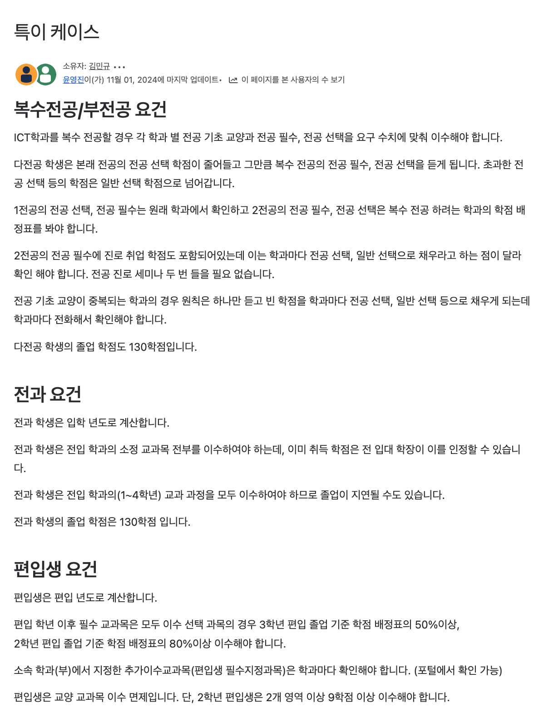

## 왜 만들게 되었나

24년, 나는 27살의 나이로, 일반 휴학 2년과 군 휴학 3년을 거쳐 대학교 3학년에 복학했다. 그러나 지난 학창 시절을 성실하게 보내지 않았던 탓에 졸업까지 상당한 학점이 남아 있었고, 휴학 중에는 자퇴를 진지하게 고민할 정도로 졸업과는 거리가 멀었다.

그런데 막상 복학하고 보니 졸업 요건을 확인하는 것부터가 쉽지 않았다. 입학 이후 여러 번 바뀐 이수 조건과 학점 기준들을 하나하나 확인해야 했고, 이 과정은 상당히 복잡했다. 무엇보다, 내가 현재까지 들은 과목들이 졸업 요건을 충족하는지 확인하는 과정이 너무 번거로웠다.

이런 문제를 해결하기 위해 학적과를 찾았지만, 현실은 예상보다 더 녹록지 않았다. 개강과 졸업 시즌에는 행정 업무가 폭주하다 보니, 개인의 상황을 일일이 살펴볼 여력이 부족했다. 때로는 담당자가 비전문적인 답변을 주거나, 같은 질문을 해도 다른 답변이 돌아오는 경우가 많았다. 결국 졸업 계획을 세우는 과정에서 누구의 도움도 제대로 받을 수 없었다.

이때 문득 생각했다.
**“졸업 요건을 자동으로 분석해주는 서비스가 있다면 얼마나 편할까?”**

이 고민이 **‘척척학사’** 프로젝트의 시작이었다.

  

  
  

  

  
  

나의 고민이 나 혼자만의 고민은 아닌지 확인하고 싶었다. 마침 이 시기에 크롤링 강의를 수강하고 있었고, 배운 내용을 활용해 교내 포털을 크롤링하여 나의 수강 내역을 가져오는 웹앱을 만들었다. 그리고 이를 교내 학생들이 제일 많이 이용하는 커뮤니티 '에브리 타임'에 올렸다.

가설 검증을 위한 앱을 만드는 데는 3시간 정도 밖에 소요되지 않았고 내가 확인하고 싶었던 건 2가지였다.

**1. 내가 만드려는 서비스가 기술적으로 가능한가?**

**2. 내가 만드려는 서비스가 학생들에게 필요한가?**

1번 목표를 달성하기 위해 가장 큰 허들이었던 학사 데이터를 가져오는 과정을 성공적으로 해결했다.

Selenium을 활용해 교내 포털에 로그인한 후, 수강 내역을 가져오는 데 성공했다. 방대한 데이터를 정리해 내가 원하는 정보만 선별했고, 이를 기반으로 간단한 UI를 구현하기 위해 shadcn/ui를 사용해 빠르게 화면을 구성했다.

이제 남은 것은 2번 목표였다.
커뮤니티 반응은 기대 이상으로 좋았다.
많은 학우들이 나와 비슷한 불편함을 겪고 있었고, 일부는 추가적인 아이디어를 제시해주기도 했다.

이 두 가지를 확인한 후, 나는 본격적으로 프로젝트를 시작하기로 결심했다.

세부적으로 나누면 더 많은 작업이 필요했지만, 프로젝트 초기 단계에서 반드시 해결해야 한다고 생각한 주요 과제는 다음과 같았다.
	
    **1.	복잡한 졸업 요건과 도메인을 정확히 이해하기**

	**2.	각 학과별, 입학년도별 졸업 요건을 수집하고 정규화된 데이터 모델로 정리**

	**3.	학사 데이터를 자동으로 가져오는 크롤링 로직 구축**

	**4.	사용자들이 쉽게 이해하고 사용할 수 있도록 직관적인 UI/UX 설계**

그러나 이 모든 작업을 혼자서 진행하기에는 한계가 명확했다.
결국, 팀원을 모집하기로 결정했다.

## 팀원 모집

내가 찾고 있는 팀원의 조건은 명확했다.
우리가 해결하려는 **문제의 본질을 정확히 이해하고,** 이를 해결하기 위한 **기술적 역량을 갖춘 사람.**

**1. 백엔드 개발자 모집의 어려움**

처음에는 백엔드를 맡아줄 팀원을 찾으려 했다.
하지만 3~4학년 취업을 앞둔 학생들의 경우, 비즈니스 문제 해결보다는 취업을 위한 기술 스택을 쌓는 것에 더 집중하는 경향이 있었다.
즉, 도메인 문제를 깊이 고민하며 함께할 동료를 찾는 것이 쉽지 않았다.

결국, 취업계를 낼 수 있는 시기까지 1년 반 정도 남아 있는 상황이었기에,
“모르면 배우면서 하자” 라는 모토로 AI를 적극 활용하며 풀스택 개발을 직접 맡기로 했다.

**2. 디자이너 섭외 과정**

이전 회사에서 몇 개의 프로젝트를 경험하며,
디자인이 비즈니스 성공에 미치는 영향이 크다는 것을 깨달았다.

특히 **졸업 요건과 같은 복잡한 도메인 정보는, 직관적으로 전달하는 것이 필수적이었다.**
따라서 사전에 가설 검증이 성공한 MVP를 바탕으로,
이전에 해커톤에서 함께한 경험이 있던 디자이너님을 찾아가 설득했다.

“이 프로젝트를 통해 어떤 경험을 할 수 있는지, 함께하면 어떤 시너지가 날 수 있는지”
열정적으로 설명하며 협업을 제안했다.

다행히 디자이너님도 긍정적으로 받아들여 함께하기로 결정했고,
그렇게 둘이서 프로젝트를 본격적으로 시작하게 되었다. 🚀

## 프로젝트 시작

  

코드를 작성하기에 앞서, 도메인을 정확히 이해하는 것이 가장 중요했다.
먼저, 학교 포털 사이트에서 공개된 졸업 요건 정보를 수집하고 이를 정리하는 작업이 필요했다.

**1. 졸업 요건 정보 수집**

기획을 도와줄 후배 두 명을 섭외하여,
Confluence를 활용해 학과별·입학년도별 졸업 요건을 체계적으로 정리했다.

🔹 타겟 유저:

- 15학번부터 현재 입학생까지
- 교육과정이 여러 차례 개편되었으므로 변경 이력을 고려해 졸업 요건을 정리

**2. 졸업 요건의 복잡성 & 비공식적인 예외 케이스**

특히, 서비스에 대한 니즈가 강한 학생들은 다음과 같았다.
- ✅ 전과생 (다른 전공으로 변경한 학생)
- ✅ 복수전공생 (두 개 이상의 전공을 병행하는 학생)
- ✅ 편입생 (다른 학교에서 학점을 인정받아 입학한 학생)

📌 문제:
- 일반 학생들도 졸업 요건을 이해하기 어려운 상황에서, **전과·복수전공·편입생의 졸업 조건은 훨씬 더 복잡했다.**
- 학적과에서는 개별 학생의 상황에 따라 졸업 심사를 유연하게 처리하고 있었기에, **공식적으로 정리되지 않은 엣지 케이스(예외 상황)들이 많았다.**
- 이러한 **비공개 정보에 접근하기 어려웠고, 정확한 데이터를 확보하는 것이 쉽지 않았다.**

📌 해결 방법:
- 학적과에 직접 전화하거나 방문하여 정보를 수집 📞
- 그러나, 비공식적이고 일관되지 않은 답변이 많아, 부정확한 정보로 인해 졸업 가능성을 함부로 단정할 수 없었다.
- 따라서, 졸업 요건을 최대한 보수적으로 정리하고, 이를 기준으로 졸업 가능성을 판단하는 전략을 세웠다.

**👉 결론:
“졸업 요건을 가장 안전한 기준으로 제공하되, 개인별 상황에 따라 학적과에 직접 확인할 수 있도록 유도하는 것이 중요하다.”**

이러한 정리 과정을 거친 후, 본격적인 개발을 시작할 수 있었다. 🚀

## 기술스택 선정

우선 1인 개발로 진행되었기 때문에, 모든 개발 언어를 내가 가장 익숙한 TypeScript로 통일했다. 또한, 프론트엔드와 백엔드를 하나의 레포지토리에서 관리하고 싶었기 때문에  Supabase + Next.js API Routes 조합을 활용하여 프론트엔드와 백엔드를 효율적으로 분리하는 방식을 선택했다.

**Supabase를 선택한 이유**

- 학사 데이터는 관계형 데이터 구조(RDBMS)에 적합했으며, Supabase는 PostgreSQL을 기반으로 제공하기 때문에 스키마 관리가 용이했다.
- Supabase는 Next.js의 API Routes와 함께 사용하기 편리하며, 클라이언트와 서버 간 동일한 TypeScript 인터페이스를 활용할 수 있다
- 초기 MVP 개발 단계에서는 서버 비용을 최소화하는 것이 중요했는데, Supabase는 무료 플랜에서도 충분한 기능을 제공했다.

기존에 Python + Selenium을 활용하여 작성된 크롤링 로직 또한 TypeScript로 변경하기 위해 Playwright를 도입했다.

## 어떤 것을 배웠나

내가 지금까지 작성한 모든 코드의 절반 정도는 지워질 예정이다. 예전에 코로나로 인해 집합 금지가 해제되던 시기, 학식이 다시 운영되기 시작하는 시즌이 있었다.
이때를 맞춰 빠르게 학식 메뉴를 제공하는 간단한 앱을 만들었고, 하루 평균 2천 명 이상의 유저가 유입되었다.
이 경험을 통해 학생들에게 필요한 서비스는 **적절한 타이밍’에 제공될 때 가장 큰 반응을 얻을 수 있다**는 점을 배웠다

척척학사 역시 같은 전략을 적용하기로 했다.

학생들의 학업 계획과 가장 밀접하게 연결된 시기는 2~3월 수강 신청 시즌이다.
이 시기에 최대한 많은 학생들이 서비스를 이용할 수 있도록, 2월 말이라는 데드라인을 설정하고 프로젝트를 시작했다.
시간이 많지 않았기 때문에, 최대한 빠르게 핵심 기능을 완성하는 것이 우선순위였다.

또한, 만약 MVP가 성공한다면 서버 확장 및 마이그레이션이 필요할 가능성이 높았다.
따라서 **처음부터 완벽한 아키텍처를 구축하는 것이 아닌, MVP 개발에 최적화된 ‘빠르게 만들고 쉽게 지울 수 있는 코드’를 작성하는 것이 중요했다.**

AI와 협업하고, MVP 이후 새로운 인원이 합류할 가능성을 고려하여 내가 수행하는 작업들을 최대한 세분화해 이슈 티켓으로 정리했다. 
실제로 코드를 작성한 시간은 2주도 채 되지 않았다.
대부분의 시간은 이슈 티켓을 작성하고 정리하는 데 소요되었다.

이슈 관리툴을  활용하여 디자이너님과 공유했고,
작업 내용을 최대한 구체적으로 기록하려 노력했다. 
이렇게 세분화된 이슈 티켓 덕분에 Cursor AI와 협업할 때도 맥락을 쉽게 전달할 수 있었고,
AI가 좀 더 정확한 코드 추천을 해주는 데 도움이 되었다.

코드 리뷰는 CodeRabbit AI를 활용하여 진행했다.
덕분에 혼자 빠르게 개발하는 상황에서도 최소한의 코드 품질을 유지할 수 있었다.

새로운 프론트 개발자가 생기진 않을까 하여 scss로 스타일링 코드를 작성하였는데 차라리 AI friendly하고 나에게 편한 tailwind css를 사용하는 것이 더 편할 것 같다는 생각이 들었다.

### 서버 로직 설계와 계층 구조에 대한 고민

Next.js API Routes를 활용하여 서버로직을 작성하다보니 불편함이 있었다. 졸업 요건을 수집하고 계산하는 과정에서 여러 테이블에 걸친 데이터 조작이 필요했고, 이로 인해 트랜잭션과 동시성 문제가 고민의 핵심으로 떠올랐다.

**트랜잭션과 동시성 문제**

학교 포털에서 크롤링한 원시 데이터를 여러 테이블에 저장하고, 졸업 요건을 계산하는 로직을 구현하면서 “동시 업데이트”에 따른 데이터 정합성 문제가 걱정되기 시작했다.
내가 고민했던 두 가지 접근 방식은 다음과 같다.

- 트렌잭션 스크립트 패턴

단순 CRUD 작업에는 빠르고 직관적이지만, 코드가 여기저기 흩어져 유지보수가 어려워질 위험이 있었다.
- 도메인 모델 패턴

비즈니스 로직을 객체지향적으로 캡슐화할 수 있다는 장점이 있으나, 초기 설계와 구현이 복잡해진다는 단점이 있었다

결국, 여러 테이블에 걸쳐 데이터를 갱신하는 복잡한 작업에서는 데이터베이스 트랜잭션과 잠금 전략(낙관적 또는 비관적 잠금)을 통해 동시성 문제를 해결해야 한다는 결론에 도달했다. ORM 도입(예: Prisma, TypeORM)도 자연스러운 선택지로 떠올랐다. 왜냐하면 ORM을 사용하면 트랜잭션 관리와 동시성 제어를 보다 체계적으로 처리할 수 있기 때문이다.

**계층 구조와 데이터 처리 흐름**

우리의 데이터 흐름은 크게 세 단계로 구분된다.

**1. 크롤링 계층**

학교 포털에서 크롤링 모듈이 원시 데이터를 스크랩해 DTO를 통해 도메인 객체로 변환하고, 이를 서버로 전달한다.

**2. 비지니스 로직 계층**

크롤링된 데이터를 여러 테이블에 저장하고, 졸업 요건 계산 로직을 실행한다. 이 때, 트랜잭션과 동시성 제어가 핵심이다.
이 과정에서 단순 작업은 트랜잭션 스크립트 패턴, 복잡한 비즈니스 로직은 도메인 모델 패턴을 적절히 혼합하는 방식을 고민하게 되었다.

**3. API 계층**

Next.js API Routes를 통해 클라이언트의 요청을 받아, 계산된 졸업 요건 데이터를 반환한다. Supabase와 동일한 TypeScript 인터페이스를 사용함으로써, 프론트엔드와 백엔드 간의 데이터 교환에서 타입 안전성을 확보할 수 있었다.

**고민의 결실**

초기 MVP 개발에서는 빠르게 결과를 내는 것이 중요했기 때문에, Next.js API Routes와 Supabase를 활용하여 최소한의 비용으로 서버 로직을 구현했다. 하지만, 실제 사용자 수가 늘어나고 복잡한 비즈니스 로직을 안정적으로 처리해야 하는 상황에서는, ORM 도입과 트랜잭션 관리 기법을 적용하는 것이 장기적으로 큰 도움이 될 것이라는 결론에 도달했다.

내가 작성한 코드의 절반 이상은 앞으로 리팩토링될 예정이며, 팀원들과 함께 도메인 모델 패턴을 적용하여 보다 견고하고 확장 가능한 시스템을 구축해 나갈 계획이다.

또한, 프론트엔드에서 서버로 온 데이터를 단순히 화면에 뿌리는 것을 넘어서, 크롤링한 원시 데이터를 가공해 졸업 요건을 산출하는 과정 전반을 여러 계층으로 명확히 분리해 관리하는 방법을 고민하게 되었다. 이와 같은 접근은 추후 서버 마이그레이션이나 새로운 팀원이 합류할 때, 유지보수와 확장이 용이하도록 만드는 데 큰 도움이 될 것이다.

### 인프라 선택: Docker, Lambda, EC2 클러스터에 대한 고민

척척학사 프로젝트를 진행하면서, 졸업 요건 계산 로직과 학교 포털 크롤링을 안정적으로 처리하기 위해 여러 인프라 옵션을 검토하게 되었다. 초기에는 Next.js API Routes를 활용해 서버 로직을 작성했지만, 실제로 배포 과정에서 여러 제약에 부딪히게 되었고, 결국 더 유연한 Docker 컨테이너 기반의 솔루션, 즉 AWS Fargate로 전환하게 되었다.

**왜 Next.js API Routes로는 배포가 어려웠을까?**

로컬에서 빌드하여 실행할 때는 상관이 없었는데 Next.js API Routes를 통해 서버 로직을 배포할 때 문제가 발생했다. playwright와 브라우저 바이너리들이 실행 환경에 기본적으로 설치되어 있지 않았다.

예를 들어, Vercel과 같은 Next.js 서버리스 환경에서는 기본적으로 Headless Chrome이나 Playwright에 필요한 바이너리들이 제공되지 않는다. 이 때문에, 로컬에서는 Playwright가 정상적으로 작동했더라도, 배포된 환경에서는 필요한 브라우저 실행 파일이나 의존성이 누락되어 “launchChromium”이나 다른 메서드를 호출할 때 에러가 발생했다.

**AWS Lambda**

두번째로 고민했던 건 AWS Lambda 였다. Lambda는 서버 관리 없이 코드 실행이 가능한 서버리스 컴퓨팅 서비스로, 짧은 실행 시간과 낮은 트래픽 상황에서는 매우 효율적이다.
하지만, Playwright와 같은 브라우저 기반 크롤링 작업에서는 몇 가지 한계가 있었다.

- 제한된 실행 시간: Lambda의 최대 실행 시간이 제한되어 있어, 복잡한 크롤링 작업이나 데이터 처리에 어려움이 있었다.
- 50MB 제한: 브라우저 바이너리와 같은 무거운 의존성 설치에 제약이 있었으며, Layer를 활용하더라도 관리가 번거로웠다.

이러한 한계 때문에 Docker 컨테이너를 활용해 AWS ECS 클러스터를 구축하게 되었다.

**AWS ECS(Fargate)를 선택한 이유**

- 긴 실행 시간과 메모리 확장성:  Docker 컨테이너는 Lambda보다 훨씬 긴 실행 시간과 더 많은 메모리를 사용할 수 있다. Playwright를 통한 크롤링 작업은 때로 몇 분 이상 소요될 수 있는데, ECS Fargate는 이러한 작업에 제약이 없다.
- 환경 일관성: Docker 이미지를 통해 필요한 모든 의존성(Playwright, Chromium 등)을 컨테이너에 포함시킴으로써, 로컬 개발 환경과 프로덕션 환경 간의 차이를 최소화할 수 있다.
- 자동 스케일링 기능의 이점도 있지만 아직 써보질 않아서 모르겠다.

이러한 인프라 전환 과정은 단순히 기술적인 문제가 아니라, 제일 중요한 운영 비용 최적화, 유지보수성, 확장성 등의 요소를 고려한 결정이었다. 가장 최근의 고민으로는 생각보다 월 서버 비용이 많이 나와서 AWS IPv4를 IPv6로 전환을 검토하고 있다.

### PM으로서 배운 점

  

현재는 팀이 나 포함 두명밖에 없지만 PM으로써 몇가지 고민도 하였다. 
우리는 두명이기 때문에 커뮤니케이션에 큰 어려움은 없었다. 하지만 두명이기에 각자 맡고 있는 역할이 많았다. 이에따라 컨택스트가 자주 바뀌게 되었다. 때문에 최대한 문서화를 하려 노력했다.

이터레이션을 QA 포함 3주에서 4주 정도로 최대한 짧게 잡았다. 둘 뿐이기에 의사결정도 굉장히 빠르다. 하지만 항상 우리가 틀릴 수 있음을 전제로 하고 차라리 빠르게 피드백을 받는게 좋겠다 생각했다.  실제로 커뮤니티를 통하여 유저 피드백을 굉장히 빠르게 받을 수 있어서 재밌었다.

디자이너님과 소통할때 **"아 그 ~~한 느낌?"** 이런식으로 추상적이고 불명확하게 의사 전달을 할 때가 있었다. 미적인 부분은 오롯이 디자이너님께 맡기더라도 사용자 경험에 관련해서는 기획에 영역이기에 소통할 때 근거를 포함하여 명확하게 전달하는 것이 중요하다 생각한다. 
디자인 용어와 심리학 관련 책들을 찾아보며, 어떻게 하면 더 명확하게 의사소통할 수 있을지 고민했다.

나 혼자서 하는 프로젝트라면 좀 더 가볍게 다뤘을지 모르겠지만 팀원이 생기니 팀원의 성장에도 도움이 되는 프로젝트가 되었음 좋겠다 생각했다. 사이드 프로젝트이지만 디자이너님의 리소스도 엄청난 비용이라 생각하고 어떻게 해야 좀 더 작업하시기 편할지 고민했다.

또한, 프로젝트 초기 단계에서는 금전적 보상이 부족한 점 때문에 동기부여가 어려울 수도 있다는 우려도 있었다. 그래서 교내 대회 참가 등을 통해 팀원들에게 도전 의식을 불어넣고, 서버 비용도 벌었다. 어떻게 보면 데드라인이 명확해져서 일차적인 결과물도 나오게 된 셈이다.

작업을 하다보면 프로젝트에 애정이 생겨 객관적으로 본질을 보지 못할 수 있다 생각했다. 그래서 나의 자아를 제일 처음 이런게 있으면 좋을텐데 하며 아예 우리 서비스를 처음보는 사람으로 가두려 노력했다.

### 마무리 

작업 자체는 굉장히 재미있게 진행 중이다. 현재 내가 고민하는 부분 중에는 그때 그때 당면한 문제를 해결하다보니 사고의 확장이 아직 부족해 틀릴 수도 있는 경우도 많다. 혹시 이 글을 읽는 누군가가 더 좋은 방법을 제시해준다면 큰 도움이 되리라 기대한다. 1차 마이너 배포 데드라인 때문에 마음에 들지 않는 부분도 있지만, 이를 리팩토링하는 과정 또한 매우 기대된다.

좋은 팀원분과 함께 재밌게 프로젝트를 진행하고 있다. 덕분에 나도 여러모로 성장함을 느끼고 있어 자아실현의 행복? 을 느끼고 있다.

  

가끔 작업하다 지칠 때, 누군가의 응원 메시지를 보면 큰 힘이 된다. 앞으로도 열심히 만들어야겠다. 

이 서비스를 통하여 많은 사람들이 졸업 요건에 대한 고민을 덜 수 있길 바란다.