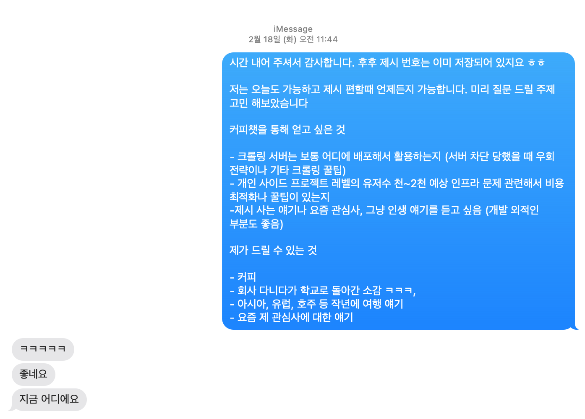
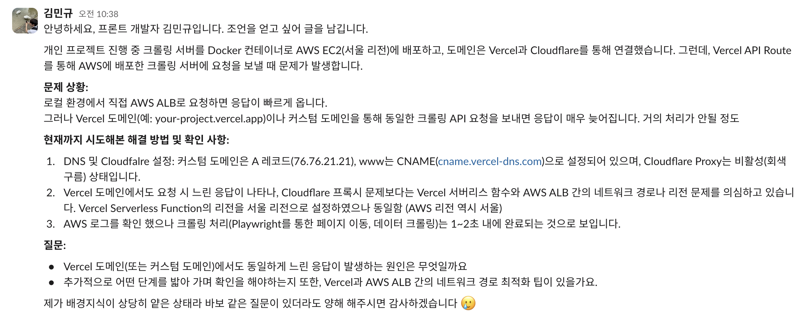
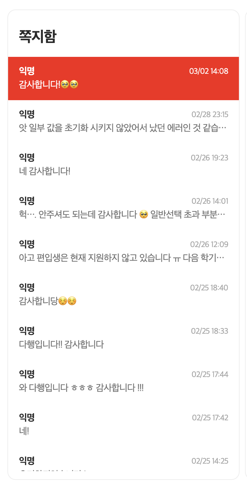

지난 [척척학사 프로젝트 1차 MVP 후기](/daily/chukchukhaksa-mvp-review)에서 MVP를 빠르게 개발한 과정을 다뤘다. 이번에는 실제 프로덕션 배포 후 3일 만에 가입자 400명을 달성하며 겪은 문제와 해결 과정을 공유하려 한다.

## ❗ Vercel Serverless Function Lifecycle 문제

### 서버리스 환경에서 크롤링이 실행되지 않음

척척학사의 핵심 기능은 사용자의 수강 및 성적 데이터를 크롤링해서 졸업 요건을 자동으로 계산하는 거다. 이를 위해 Next.js의 API Routes를 활용한 크롤링 API를 구현했고, 사용자는 `/scraping` 페이지에서 크롤링을 요청할 수 있도록 설계했다.

그런데 배포 직전 QA 테스트 중에 문제가 생겼다. 로컬 환경에서는 정상 작동하던 크롤링 API가 Vercel 서버리스 환경에서는 전혀 동작하지 않는 거였다. **즉, 사용자가 크롤링을 요청해도 실제로 크롤링이 진행되지 않는 심각한 상황**이었다.

#### 🔍 기존 코드 구조

사용자가 `/scraping` 페이지에서 크롤링을 요청하면, Next.js API Route(`/api/suwon-scrape/start`)가 실행되도록 했다.

<details>
<summary>코드</summary>

```tsx
// app/api/suwon-scrape/start/route.ts
import { NextResponse } from 'next/server';
import { getIronSession } from 'iron-session';
import { v4 as uuidv4 } from 'uuid';
import type { SessionData } from '@/lib/auth';
import { sessionOptions } from '@/lib/auth';
import { setTask } from '@/lib/crawling/scrape-task';
... 생략

export async function POST(req: Request) {
  const res = NextResponse.next();
  const session = await getIronSession<SessionData>(req, res, sessionOptions);
  const username = session.username;
  const password = session.password;

  if (!username || !password) {
    return NextResponse.json({ error: '포털 로그인이 필요합니다.' }, { status: 401 });
  }
  const taskId = uuidv4();
  setTask(taskId, 'in-progress', null);

  // 비동기로 크롤링 시작
  (async () => {
    try {

      // 실제 크롤링 로직 (생략)
      setTask(taskId, 'completed', { message: '동기화 완료' });
      // **세션 만료 처리**
      session.destroy();
      console.log('Session destroyed after successful scrape');

    } catch (err: any) {
      setTask(taskId, 'failed', { message: err.message, status: err.cause });
    }
  })();

  return NextResponse.json({ taskId, studentInfo }, { status: 202 });
}
```

</details>

#### 문제가 발생한 이유

위 코드에서 크롤링 작업은 비동기 즉시 실행 함수(IIFE) `(async () => {...})()` 를 통해 실행된다.

로컬 개발 환경에서는 문제가 없었지만, Vercel 서버리스 환경에서는 함수가 비정상적으로 종료되는 현상이 발생했다.

### 🔍 원인 분석: Vercel의 Serverless Function Lifecycle

Vercel의 서버리스 함수는 각 HTTP 요청마다 새로운 인스턴스를 생성하여 실행한 뒤, 응답을 반환하면 즉시 종료된다.
즉, 함수 내부에서 return 이후에 실행되는 비동기 코드가 있더라도, 응답이 완료되는 순간 해당 실행 컨텍스트가 사라질 가능성이 높다.

**로컬 개발 환경에서는?**

- Next.js 개발 서버가 계속 떠 있기 때문에, 응답 후에도 백그라운드 작업이 정상적으로 실행됨.

**Vercel 서버리스 환경에서는?**

- 서버리스 함수는 요청을 처리한 후 **곧바로 종료**되므로, 응답 후 실행되는 코드가 사라질 수 있음.
- 특히 비동기 즉시 실행 함수(IIFE) `(async () => {...})()` 내부에서 실행되는 크롤링 작업이 **제대로 실행되지 않음.**

### ✅ 해결 방법

### 1️⃣ 배포 직전의 임시 해결책: 동기 실행 방식으로 변경

당시 배포 하루 전이었기 때문에, 가장 빠른 해결 방법은 비동기 실행을 동기 실행으로 변경하는 것이었다.
즉, `(async () => {...})()` 대신 `await`을 사용하여 응답을 반환하기 전에 크롤링을 동기적으로 실행했다.

🚀 이 방식으로 문제는 해결되었지만, 응답 시간이 길어지는 단점이 있었다. 이 때문에 vercel plan을 pro로 올리고 **Function Max Duration**을 5분 max 값으로 설정했다. (실제로 크롤링은 7~10초 내외로 끝났다)

이후 서버리스 환경에 적합한 최적의 방법을 찾아 봤다.

### 2️⃣ 장기적인 해결책: 백그라운드 작업을 안정적으로 실행하기

#### ✅ Vercel의 Fluid Compute 활용 (`waitUntil` API)

2023년 말, Vercel은 서버리스 환경에서 백그라운드 실행을 보장하는 Fluid Compute 모델을 도입했다.
이를 활용하면, 응답을 반환한 후에도 일정 시간 동안 서버리스 함수가 실행되도록 유지할 수 있다.

```tsx
export async function POST(req: Request) {
  const res = NextResponse.next();
  res.waitUntil(
    (async () => {
      await someLongRunningTask(); // 크롤링 작업
    })()
  );
  return NextResponse.json({ message: "크롤링 시작됨" }, { status: 202 });
}
```

따라서 Fluid Compute를 사용하면, “응답 후에도 로직을 계속 실행해야 하는” 문제를 해결할 수 있다. 다만 모든 지역(리전)이나 프로젝트에서 자동 적용되는 것은 아니므로, 배포 시 조건과 설정 여부를 확인해야 한다.

✔ **장점:** 응답을 즉시 반환하면서도 크롤링이 정상적으로 실행됨  
❌ **제한:** Fluid Compute가 활성화된 프로젝트에서만 사용 가능

#### ✅ Next.js 15.1의 `after()` API 활용

Next.js 15.1에서는 응답 후 실행할 코드를 등록할 수 있는 after() API가 추가되었다.
이는 내부적으로 Vercel의 waitUntil()과 유사한 방식으로 동작한다

```ts
import { NextResponse, after } from "next/server";

export async function GET() {
  // 주 요청 처리
  const data = await fetchSomeData();
  const response = NextResponse.json(data);

  // 응답 후에 실행할 비동기 로직 등록
  after(() => {
    console.log("이 코드는 응답 후에도 실행됨.");
    // DB 업데이트, 로그 전송 등
  });

  return response;
}
```

위와 같이 after()를 사용하면 클라이언트에는 이미 응답을 돌려준 상황에서도, 함수가 일정 시간 유지되면서 추가 로직을 처리할 수 있다. 이로써 응답 시간을 최소화하면서 백그라운드 작업을 안전하게 실행할 수 있다.

✔ **장점:** Next.js에서 기본 제공하는 기능이라 별도 설정이 필요 없음  
❌ **제한:** Vercel이 아닌 다른 서버리스 환경에서는 지원되지 않을 수 있음

#### ✅ 그 외 백그라운드 처리 기법들

만약 Fluid Compute나 after()를 사용할 수 없는 버전/환경이라면, 서버리스 함수에서 응답 이후 작업을 수행하기 위해 일반적으로 아래 같은 패턴을 활용한다:

1. **다른 함수로 위임(“Fire-and-forget”)**

- 첫 번째 함수가 간단히 요청을 받고 바로 응답한 뒤, 내부적으로 다른 API Route(혹은 별도 서버)를 비동기로 호출하여 긴 작업을 대신 수행하도록 넘김
- 이렇게 하면 첫 번째 함수는 빠르게 종료되므로 타임아웃이나 응답 지연 문제를 피할 수 있다.

2. **메시지 큐 / 작업 대기열 사용**

- 별도의 큐 서비스(SQS, SNS, Upstash QStash 등)에 작업 메시지를 넣어두고, 큐가 트리거하는 다른 서버리스 함수(또는 워커)가 실제 크롤링/분석 등의 장시간 작업을 진행하는 방식
- 확장성이 좋지만, 외부 서비스 설정 및 추가 비용 부담이 있을 수 있다.

3. **Vercel Cron Jobs 활용**

- 정기적 혹은 예약된 백그라운드 작업이 필요하다면, Vercel Cron Jobs 기능을 통해 지정된 간격으로 서버리스 함수를 자동 실행할 수 있다.

결국 **요청-응답 주기를 최대한 짧게 유지하고, 무거운 작업은 비동기로 분산**하는 것이 서버리스 환경에서의 모범 사례다.

## ❗ 특정 학과의 데이터 크롤링 문제

### 학부 코드가 없는 일부 학과에서 크롤링 실패

크롤링 과정에서 유저의 학부 코드와 학과 코드를 수집한 후, 졸업 요건을 계산하는 구조였다.  
**그런데 일부 학과에서는 학부 코드가 존재하지 않는 문제가 발생했다.**

배포 전 테스트 계정에서는 모두 학부 코드가 존재했기 때문에, 이 문제를 미리 발견하지 못했다.
그 결과, 배포 첫날 약 10%의 유저들이 졸업 요건을 계산할 수 없는 상황이 발생했다.

### ✅ 해결 방법

✔ **학부 코드가 없어도 학과 코드만으로 졸업 요건을 계산하도록 로직 수정**  
✔ **사용자에게 더 명확한 오류 메시지를 제공**

## ❗ CS(Customer Support) 비효율 문제

처음에는 "알 수 없는 에러가 발생하였습니다" 라는 메시지만 제공했기 때문에,
사용자 입장에서 무슨 문제가 발생한 건지 알 수 없었고, CS 처리도 비효율적이었다.

**기존 CS 대응 프로세스**

    1.	사용자가 “에러 발생” 문의
    2.	개발자가 사용자 학번을 받아 Sentry 로그 검색
    3.	Vercel/AWS 로그에서 원인 추적
    4.	문제를 찾아 사용자에게 안내

**❌ 너무 많은 단계를 거쳐야 했고, 대응 속도가 느렸다.**

### 🧐 고민

사용자에게 어느 정도 수준까지 오류에 대해 알려주면 좋을까? 예를 들어 사용자에게 학부코드가 없어서 에러가 발생했다고 서버 로그에 노출된 메시지를 그대로 전달할까 생각해봤다. 그런데 사용자가 그걸 알 필요가 있을까? 사실상 개발자가 아닌 사용자 입장에서 무슨 뜻인지 잘 모를 가능성이 크다. 그리고 UX가 오히려 복잡해지거나 불필요한 혼선을 줄 수도 있다고 생각이 들었다.

### ✅ 해결 방법

#### 1. 사용자에게 보여줄 메시지 개선하기

사용자에게는 복잡한 기술적 설명보다 간결하고 명확한 정보가 필요했다.

**오류 코드 시스템 도입**

- "오류가 발생했습니다. (오류 코드: ERR-1023)" 같은 일관된 형식으로 변경
- 아직 서비스 초기라 모든 오류 코드를 정의하진 못했지만 차차 정의해 나갈 계획
- 예: `ErrorDepartmentGroupMissing` → `ERR-1023`

**행동 지침 추가**

- "문제가 반복될 경우 캡처 화면과 학번을 고객센터(사실상 나)로 문의해주세요"
- 새로고침으로 해결될 수 있는지, 아니면 반드시 CS에 문의해야 하는지 명확하게 안내

#### 2. 내부 로깅 시스템 개선

서버와 모니터링 시스템에서는 더 상세한 정보를 관리하도록 했다.

**세분화된 에러 로깅**

- Sentry에 오류 스택 트레이스와 함께 "유저 ID", "학번", "에러 코드", "발생 시점" 등을 태깅(이미 되어있음)
- 예상 가능한 예외 케이스들은 별도 예외 클래스를 만들어 자동으로 분류되도록 구현

**CS 효율성 향상**

- 에러 코드로 CS 할 때 빠르게 로그를 조회하거나 필터링할 수 있게 함
- 같은 에러가 몇 건 발생했는지, 어떤 사용자에게 자주 발생하는지 통계도 가능해짐

#### 3. 사용자 중심 접근법

사용자 입장에서는 "왜 에러가 났는지"보다 **지금 당장 내 문제를 어떻게 해결하면 되는지**가 훨씬 중요하다고 판단했다.

사용자가 "알 수 없는 에러"라는 막연한 메시지 대신 "무언가 오류가 났지만, 여기 적힌 코드로 문의하면 해결될 거야" 정도로 인지할 수 있게 되면 좋겠다. 결과적으로 불필요한 CS 반복 문의도 크게 줄일 수 있길 바란다.

## 번외

### Supabase 사용기

이전 글에서도 언급했지만, supabase 사용하면서 체감한 가장 크게 느낀 장점은 admin이다. 이걸 직접 개발할 생각을 했으면 리소스가 꽤나 들었을 것 같다. 두번째로는 천명까진 거뜬한 무료 플랜...

### 도움 받기

수강 신청 시즌에 맞춰 배포를 해야했기에 그 당시 며칠 잠을 못자고 개발을 했다. 그 과정에서 앞서 말했던 **Vercel Serverless Function Lifecycle** 문제를 배포 하루전에 겪었는데 이 문제를 해결하기 위해 여러 방면으로 도움을 받았다.

<div style={{ display: "flex", justifyContent: "center", margin: "2rem 0" }}>
  <div style={{ width: "80%" }}>
    
  </div>
</div>

먼저 전 직장 동료분께 해당 문제에 대해 여쭤보고자 커피챗을 요청했는데, 흔쾌히 도움을 주셨다. 운이 좋게 당일 시간이 맞아 문제 접근과 해결 방법에 정말 큰 도움을 받았다. 기술적인 조언뿐만 아니라 비슷한 상황에서의 경험담도 들려주셔서 더욱 값진 시간이었다. 이런 선배 개발자분들의 도움이 없었다면 며칠은 더 헤맸을 것 같다. 앞으로 나도 누군가에게 이런 도움을 줄 수 있는 개발자가 되고 싶다는 생각이 들었다.

<div style={{ display: "flex", justifyContent: "center", margin: "2rem 0" }}>
  <div>
    
  </div>
</div>

"글또" 백엔드 인프라 채널에도 질문을 올렸다. 답변자의 시간을 아끼고 정확한 해답을 얻으려면 명확한 질문이 중요하다고 생각한다. 하지만 배경지식이 얕은 영역에서는 어떻게 질문을 구성해야 할지 아직도 고민이 많다. 모르는 것을 물어볼 때 "무엇을 모르는지도 모르는" 상황이 종종 발생하기 때문이다. 그래도 최대한 내가 시도한 방법과 마주친 오류를 정리해서 공유하려고 노력했다.

### CS

<div style={{ display: "flex", justifyContent: "center", margin: "2rem 0" }}>
  <div style={{ width: "40%" }}>
    
  </div>
</div>

회사를 다닐 때는 CS 처리를 하기까지 내 앞에 CS 담당자, QA, PO 등 여러 직군의 분들이 계셨다. 하지만 이번에는 개발과 운영을 혼자 하다 보니 문제가 생기면 내가 바로 처리해야 했다. 아침에 일어나면 안된다는 부정적인 메시지로 시작을 하다보니 처음에는 엄청 스트레스를 받았다.

그런데 이 과정에서 많은 반성을 하게 됐다. 회사에서는 내 코드가 만든 문제를 다른 팀원들이 완충해주고 있었다는 걸 깨달았다. 이제는 개발자의 영역에서도 사용자에게 더 좋은 경험을 줄 수 있도록 설계해야 한다는 생각이 강하게 들었다. 에러 메시지 하나, 로깅 방식 하나가 얼마나 중요한지 몸소 체험하게 된 셈이다

### 비용

직접 운영을 하면서 서버 비용도 꽤나 나오게 됐다. 처음에는 무료 플랜을 사용했지만, 크롤링 요청이 많아지면서 비용이 월 10만원 이상 점점 늘어나기 시작했다. 이 때문에 비용을 줄이기 위해 여러 방면으로 노력했다. 메모리 누수가 없도록 코드를 최적화하고, 크롤링 요청을 최소화하는 UX 수정 등의 조치를 취했다. 인프라 관련해서도 모니터링 차트를 보면서 서버 리소스를 적절히 조절했다.

비용 문제는 가난한 학생으로서 정말 고민이었다. 개발하면서 돈 걱정하기 싫어서 교내 대회나 창업 동아리 등을 알아보고 신청했다. 다행히 120만원 가까운 지원금을 받을 수 있었고, 이걸로 마케팅 비용과 서버 비용을 충당할 수 있게 됐다. 아이디어와 열정만으로는 부족한 현실적인 부분을 해결할 수 있어 다행이었다

## 마치며

이번 프로젝트로 내가 모르던 영역에 대해 많이 배웠다. 서버리스 환경에서 백그라운드 작업을 안정적으로 돌리는 방법은 특히 유용했다. 또한 사용자와 직접 소통하며 에러 메시지 하나, 로그 설계 하나가 얼마나 중요한지 깨달았다. 개발자로서 코드 너머의 사용자를 더 깊이 생각하게 된 소중한 경험이었다. 아직 갈 길이 멀지만, 조금씩 나아지는 서비스를 만들어가는 과정이 즐겁다.

## 참고자료

- [Vercel Serverless Function Lifecycle](https://vercel.com/docs/functions)
- [Vercel Fluid Compute blog](https://vercel.com/blog/introducing-fluid-compute)
- [Vercel Fluid Compute docs](https://vercel.com/docs/functions/fluid-compute)
- [Vercel Function Limits](https://vercel.com/docs/functions/limitations)
- [Next.js 15.1 after() API](https://nextjs.org/blog/next-15-1)
- [API routes with Vercel Serverless Functions and NextJS](https://dev.to/sushmeet/api-routes-with-vercel-serverless-functions-and-nextjs-5goa#:~:text=Conclusion)
- [How to Run background jobs on Vercel without a queue](https://zackproser.com/blog/how-to-run-background-jobs-on-vercel-without-a-queue)
- [Vercel Functions and QStash](https://upstash.com/blog/email-scheduler-qstash)
