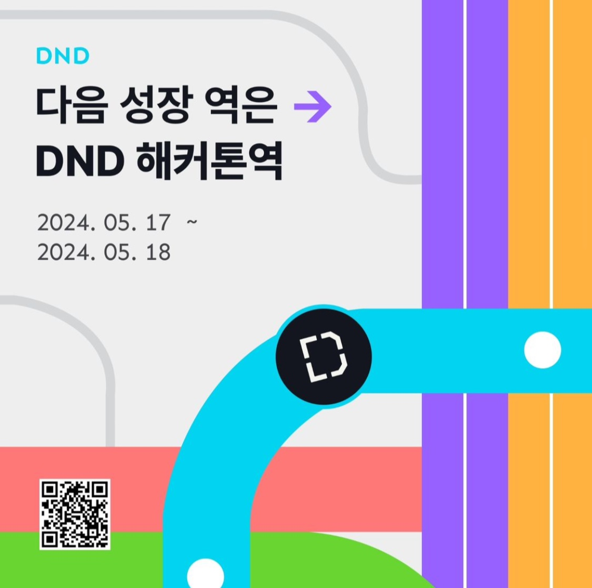
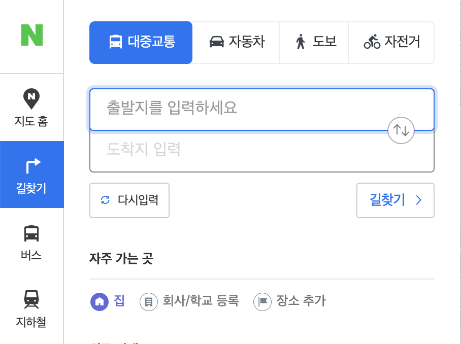

    

 

어쩌다 보니 오랜만에 글을 쓰게 되었다. 마지막 글 이후 다양한 일들이 있었다. 가장 큰 이벤트는 퇴사와 복학이다. 24년 2월에 나는 다시 학교로 돌아가기 위해 퇴사를 했다. 이 과정에서 많은 고민이 있었지만, 오늘의 주제와는 조금 다른 이야기이기에 간단히 말하자면, 조금 더 나를 돌아볼 시간이 필요했기 때문이다.
 
복학 이후 21학점으로 꽉 채워 수업을 들었다. 그래도 회사 다닐 때 주 40시간 근무와 퇴근 후 가끔 공부를 하던 루틴에 익숙했던 나는 꽤 많은 시간이 남게 되었다. 3년 차 직장인이 비슷한 전공의 3학년으로 돌아갔을 때, 학교 과제는 큰 어려움이 없었다. 복학한 시간을 좀 더 알차게 보낼 수 없을까 고민한 끝에, 내가 학교 다닐 때는 코로나 시기라 참여가 어려웠던 오프라인 이벤트들을 해보자는 결론에 이르렀다.
 
그것은 공모전과 해커톤이었다. 공모전의 경우 서울시에서 하는 [2024 서울 열린데이터광장 공공데이터 활용 창업경진대회](https://linkareer.com/activity/172705)에 참가했다. 캠퍼스픽을 통해 다른 대학교 팀에 합류했다. 처음 나가는 공모전이었는데, 요즘은 AI 모델을 활용해서 결과물을 내는 것이 공모전 트렌드인 것 같았다. 개발 기간은 약 한 달이었고, 실 개발 시간은 약 20시간 정도로 1차 산출물을 제출했다.

해커톤 같은 경우, 과거 활동했던 [연합동아리 DND](https://www.dnd.ac/)에서 주관한 것이었다. 인스타그램 피드를 내리던 중 홍보 포스터를 보고 신청하게 되었다. 여느 대외활동들과 마찬가지로 서류 심사가 이루어졌고, 크게는 지원 동기와 개발하면서 문제를 맞닥뜨렸을 때의 해결 과정에 대해 작성했다. IT 대외활동의 경우 경쟁률이 점점 높아지는 추세였지만, 이번 해커톤은 다행히 서류 통과가 되었다. 개인으로 참가했기 때문에 서류 결과가 나온 차주 월요일까지 팀 빌딩을 마쳐야 했다.
 
팀 빌딩 과정은 정글과 같았다. 자기소개서를 작성했지만, 먼저 연락이 오지 않았다. 그동안 블로그나 깃허브 활동에 노력을 기울이지 않았던 탓에 내 상품성이 떨어져 보였던 것 같아 반성하게 되었다. 나서는 걸 좋아하는 성격은 아니지만, 이대로 가면 내 첫 해커톤에 후회가 남을 것 같아 몇 분께 연락을 보냈다. 동시에 프론트엔드 개발자 하민님께도 연락이 왔고, 좋은 분들과 팀을 이루게 되었다.
 
해커톤은 총 세 가지 키워드를 주제로 진행되지만, 사전에는 두 가지만 공개되고 나머지 하나는 당일에 공개된다. 대회 전까지 팀원들과 두 번에 걸쳐 브레인스토밍을 하고 몇 가지 아이디어를 뽑아냈다. 내가 제시한 아이디어는 네이버 CLOVA AI 모델을 활용한 것이었다. 먼저 공개된 키워드가 '지역'과 '일상'이었기에, AI 모델을 활용하여 표준어를 지역 사투리로 변환해주고 이를 퀴즈 형식으로 풀어가는 서비스에 대한 의견을 냈고 팀 단위에서 채택되었다. 이 서비스에 대한 근거는 다음과 같다. 첫째, 해커톤 주제와 부합한다. 둘째, 요즘 공모전들도 AI를 활용한 것이 많았기에 마지막 키워드 역시 AI일 거라 생각했다. 셋째, 1박 2일, 실 개발 시간으로는 그보다 훨씬 적은 시간 내에 완성해야한다. 메인 기능을 AI를 활용해 대체할 수 있기에 완성도 측면에서 유리할 것이라 생각했다.
 
그렇게 해커톤 당일이 되었다. 입장 한 시간 전, 시간이 맞는 팀원들과 먼저 만나 밥을 먹었다. 디자이너 준희님이 추천해주신 베트남 식당에 갔었는데, 여태 먹은 쌀국수 중에 top 3에 드는 맛이었다. 정말 맛있었다. 가벼운 아이스브레이킹 후 스타벅스에서 아아 tall 사이즈를 포장하여 마시며 대회장으로 출발했다.
 
대회장에 도착했을 때 이미 많은 사람들이 와 있었다. 오프라인 행사는 처음이었기에 설레는 마음을 안고 지정된 우리 팀 자리로 가서 나머지 팀원들과 인사를 나눴다. 자리에 앉아 노트북을 펼칠 즈음 행사가 시작되었다. 추가로 세 번째 키워드가 공개되었는데, '불편함'이었다. 예상한 주제와는 조금 달랐다. 첫 번째와 두 번째 키워드인 '일상'과 '지역'과 엮어 '일상 속의 불편함' 혹은 '지역 간의 편차'를 해결해주는 서비스가 주제가 되었다. DND는 서울에 편중되어 있는 기술 공유와 서비스를 지방에서도 나누고자 하는 취지로 설립 되었기에 DND 해커톤에 맞는 주제인 것 같기도 하다.
 
### 대회 시작

우리 팀은 시작 후 한두 시간 내에 어떤 서비스를 만들지 결정해야 했다. 해커톤에서는 제시된 주제와 밀접한 서비스를 만들어야 좋은 평가를 받을 수 있다는 것은 공공연한 사실이다. 하지만 좀처럼 아이디어가 떠오르지 않았고, 나는 우선 팀원들이 제시한 주제를 토대로 주어진 시간 내에 기술적으로 가능한지에 초점을 두고 의견을 나눴다. 결국, 우리는 지방에 거주하는 친구가 수도권에서 만나게 될 때 소비한 시간과 비용의 정량 데이터를 수도권 친구에게 재미있게 가공하여 전달하는 서비스를 만들기로 했다.

방향성이 정해지고 나서, 프론트엔드 개발자인 내가 해야 할 일은 다음과 같았다:

- 피그마 디자인을 기반으로 UI 구현하기
- 사용자에게 주소를 입력받고 이를 좌표로 변환하여 서버에 제공하기
- 서버와 주고받을 데이터 형식을 정하고 데이터 처리하기
- 지방 친구의 결과 페이지를 서울 친구에게 공유하는 기능 만들기
- 지방에 사는 친구가 서울에 갈 때 소비한 시간과 비용의 정량 데이터를 얻기

이것이 핵심 기능이며, 우선 가장 중요한 것은 내가 할 수 있는 일과 할 수 없는 일을 팀원들에게 빠르게 공유하는 것이었다.
 
디자이너와 함께 소통하며 기능을 정의하고 중요도 순으로 일을 나누었다. 우선 디자인 작업이 진행될 때, 우리 서비스의 핵심 기능인 사용자에게 주소를 입력받고 이를 좌표로 변환하여 서버에 제공하는 작업을 처리해야 했다. 지도나 좌표에 관련된 기능은 공모전이나 해커톤 단골 주제이기도 하고, 카카오 맵 API, 네이버 맵 API 등 오픈 API도 많이 찾아볼 수 있다. 하지만 나는 이번 해커톤에서 처음 접하는 기능이었다. 관련하여 30분 정도 리서치를 한다고 팀원들에게 공유하고 그동안 빠르게 리서치를 했다.
 
처음에는 사용자가 지도를 통해 현재 위치를 확인하고 마크를 찍어 해당 좌표를 제공할 생각이었다. 하지만 이 경우 지도 서비스를 자체적으로 임베딩하여 화면에 표시해야 했기 때문에, 우리 서비스의 디자인 흐름과는 거리가 있었다. 따라서 대신, 사용자가 직접 주소를 입력하고 이를 좌표로 변환하는 방법을 선택했다. 이 방식이 우리 서비스의 디자인과 사용자 경험 측면에서 더 자연스러울 것이라고 판단했다.
 
 

    

 
사용자는 여느 길찾기 서비스처럼 출발지와 도착지만 지정하면 되기 때문에, 굳이 지도를 임베딩할 필요는 없다고 생각했다. 그래서 사용자가 주소를 입력받을 때 우편번호 검색과 도로명 주소 자동 완성이 필요했고, 이는 [Kakao Postcode API](https://www.npmjs.com/package/react-daum-postcode)를 활용했다.

마찬가지로 임베딩이 필요하지만, 인풋 창을 클릭했을 때 바텀 드로워를 통해 노출시켜 주어 비교적 디자인 컨셉에 크게 어긋나지 않도록 했다.
 

<iframe width="361" height="640" src="https://youtube.com/embed/aUqns_hBc3o?si=NC-ghKu8afNoDvp-" frameborder="0" allow="accelerometer; autoplay; clipboard-write; encrypted-media; gyroscope; picture-in-picture" allowfullscreen></iframe>

 
사용자에게 주소를 입력받고 이를 좌표로 변환하여 서버에 보내야 했다. 이는 주소를 사용하여 좌표를 얻는 Naver Open API의 geocode를 호출하였다. 여기까지는 비교적 순탄하였으나 유저는 실제로 출발 좌표에서 도착 좌표로 직선으로 이동하는 것이 아니다. 버스를 탈 수도, 지하철을 탈 수도 혹은 비행기를 탈 수도 있다. (우리 서비스에서 자차이동은 제하기로 해였다.) 언제 출발하는지 혹은 어떻게 가느냐에 따라 시간과 비용이 다르다. 우리 서비스의 궁극적인 목표는 지방에 사는 친구가 서울에 갈 때 소비한 시간과 비용의 정량 데이터를 가공해 보여주는 것이기에 이 핵심적인 기능을 완성하는게 가장 큰 목표다. 처음에는 네이버 맵 api를 통하여 해결할 수 있을 줄 알았으나 [자동차로 이동하는 거리 정보](https://api.ncloud-docs.com/docs/ai-naver-mapsdirections-driving) 밖에 얻을 수 없었다. 기획도 당일에 한 것이라 대안을 생각치도 못했기에 적잖이 당황하였다. 팀원들에게 해당 문제를 공유하고 40분 정도 리서치를 하여 우리 서비스에 적용하기 가장 적합한 [대중 교통 open api인 odsay](https://lab.odsay.com/#)를 찾아 공유하였다.
 
이를 통해 어려운 문제는 일단락 되었고, 남은건 남은 시간 내에 완성도 있는 서비스를 구현하는 일이었다. 이때즘 시간이 새벽 1시~2시 사이였던 것 같은데, 어릴적부터 컴퓨터 앞에서 오랜 시간을 앉아 있었던 나는 체력적으로 큰 무리는 없었다. 사실 그 사이 운영진 분들께서 치킨과 피자를 제공해주어 야식 타임도 갖었다. 하지만 나는 앞에서 말한 우리의 핵심 기능에 관련한 문제를 생각하느라 먹어도 입으로 들어가는지 코로 들어가는지 체할 것 같아 몇 조각 먹지는 못했다.
 

    

    

 

화장실 갈 시간을 제외하면 노트북에 앉아 개발만 하기를 수시간, 해가 뜨고 마감 시간이 다가왔다. 거의다 완성하였지만 아이스 아메리카노 1잔, 핫 식스 4캔, 몬스터 1캔으로 도핑하며 버티던 내 체력에도 한계가 다가왔다. 최대한 긍정적인 분위기를 만드려 노력했던 나지만 말 수도 급격히 줄고, 가끔 운영진 분들이 돌아다니며 “피곤하시진 않냐며” 말을 건네곤 했는데 대답을 잘 못하고 개발만 한 것 같다. (죄송합니다.)
 
핵심 기능과 처음 합의된 기능 구현을 마치고 내 개인적인 욕심으로 완성도를 높이기 위해 UX적인 요소를 넣었다. 우리 서비스는 위자드 형식으로 꽤 긴 퍼널이 존재했다. 사용자는 언제까지 입력을 해야하는지 피로도를 느낄 수 있다 생각하여 상단에 진행도를 나타내는 프로그래스 바와 퍼널 간 흐름이 좀 더 유려하게 느껴지도록 슬라이드 기능을 추가하였다. 여유 시간에 개발하고 짜잔하고 팀원들에게 보여주었다. 좋은 소통 방식은 아니었지만, 팀원들이 좋아하여 다행스럽게 우리 서비스에 끼워 넣게 되었다. 태생이 관종인 나는 이러한 즐거움 때문에 프론트엔드 개발자를 하고자 함이 아닌가 싶다.
 
 

    <iframe width="361" height="640" src="https://youtube.com/embed/WJ3W6zTLnYg?feature=share" frameborder="0" allow="accelerometer; autoplay; clipboard-write; encrypted-media; gyroscope; picture-in-picture" allowfullscreen></iframe>

 
그렇게 마감시간 15분 전에 모든 기능을 완성하였다.

대망의 수상자 발표 시간이 되었다. 하루밖에 지나지 않았지만 우리가 만든 서비스에 정이 들었고, 제한된 시간 내에 가진 능력을 최대한 발휘했기에 결과가 어떻든 후회는 없었다. 많은 팀들이 발표를 시작했고, 우리가 아이데이션한 후보 주제를 채택한 팀들도 몇 팀 있었다. 다들 비슷한 생각을 했나 보다. 모든 팀이 재밌는 결과물을 내놓아 보는 내내 즐거웠다.

인기상과 2등이 호명되고 1등만 남았을 때, 자만이지만 우리 팀이 1등일 것 같다는 생각이 들었다. 역시나 우리 “럭키비키” 팀이 1등을 수상했다. 좋은 팀원들을 만난 덕분이다.

### **얻어간 것**

 

    

        
    

 

처음으로 해커톤에 참여하면서 가장 기대했던 것은 열정 있는 팀원들과 함께 서비스를 만드는 경험이었고, 이 기대를 넘치도록 충족했다. DND를 통해 좋은 경험을 할 수 있어 관계자 분들 그리고 우리 팀원분들께 감사하다. 1등이라는 결과도 물론 좋지만, 짧은 시간 동안 이렇게 좋은 팀워크를 얻어간 경험은 잊지 못할 것 같다.
 
해커톤은 주어진 키워드와 맞는 주제로 짧은 시간 내에 MVP를 만들어내야 한다. 나는 팀원들이 좋은 의견을 낼 수 있도록 편안한 분위기를 만들기 위해 노력했다. 명확하게 할 수 있는 것과 할 수 없는 것을 나누고 팀원들에게 공유한 점, 그리고 팀원들이 크게 고민할 필요 없는 부분은 빠르게 결정하도록 도운 것이 이번 해커톤에서 좋은 성적을 낼 수 있었던 큰 이유라고 생각한다.

또한 서버 배포 리소스를 줄이기 위해 [ngrok](https://ngrok.com/)을 제안하여, 이를 통해 실시간으로 백엔드와 협업한 것도 큰 도움이 되었다.
 
아쉬운 점으로는 네트워킹할 기회가 적었다. 중간 중간 미니 게임도 진행하였지만, 각자 서비스를 개발하기에 빠듯한 시간이었다. 여느 해커톤 후기를 봐도 이 점은 항상 아쉬운 점으로 언급되는 것 같다. 우리 팀원분들과도 각자의 경험을 얘기할 시간은 적었기에 이후 뒷풀이 모임을 갖기로 하였다. ㅎㅎ
 
해커톤은 정말 힘들지만 그만큼 얻어가는 것이 많았다. 나는 항상 완벽하게 일처리를 하고 싶어 시작도 못할 때가 많다. 하지만 해커톤을 통해 완성을 목표로 일단 행동하니, 생각보다 훨씬 좋은 결과를 얻었다. 그 과정에서 완벽을 추구하며 생각만 하는 것보다 더 많은 것을 배울 수 있다는 것을 깨달았다. 체력적으로는 후폭풍이 크게 오긴 했지만, 반기별로 한 번 정도는 정말 재밌게 즐길 수 있을 것 같다.