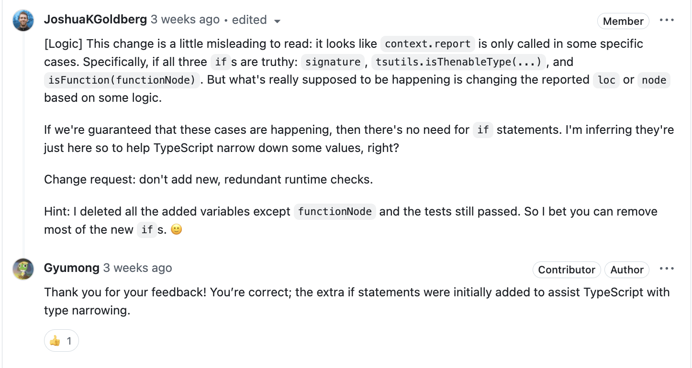
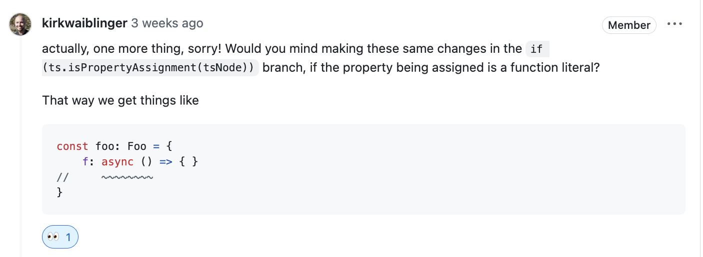
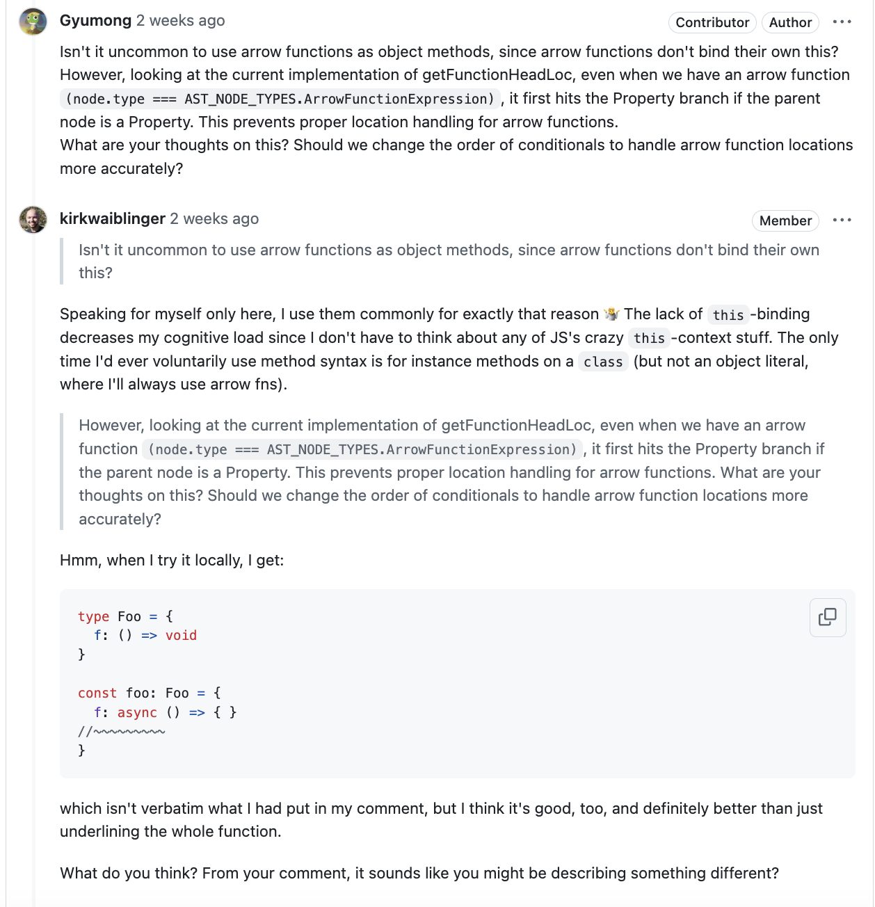
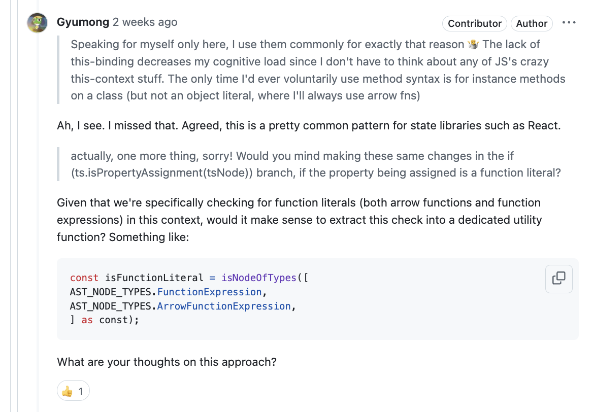
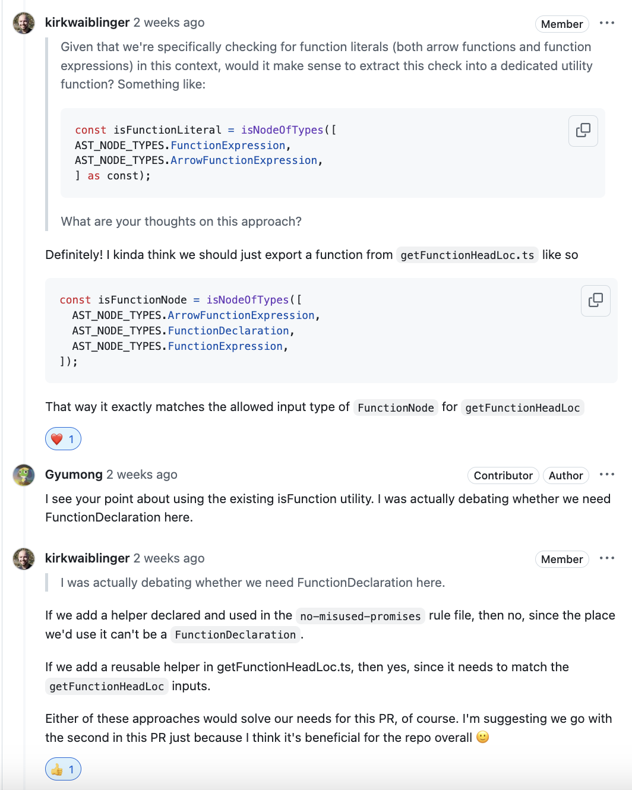

# TL;DR

지난 글 이후로도 오픈소스 활동을 꾸준히 이어왔다. 현재까지 총 7개의 PR을 보내 모두 성공적으로 머지되었다. 이번 글에서는 typescript-eslint의 no-misused-promises 규칙 개선 경험을 중심으로, 오픈소스 기여 과정에서 배운 점과 느낀 점을 공유하고자 한다.

## 기여한 프로젝트

### toss/es-toolkit
  - [feat(sample): Add sample to compat layer](https://github.com/toss/es-toolkit/pull/708#event-14619690856)
  - [feat(union): add union to compat layer](https://github.com/toss/es-toolkit/pull/778#event-15054115252)
  - [fix(union): add missing union export](https://github.com/toss/es-toolkit/pull/788)
  - [feat(uniqBy): add uniqBy to compat layer](https://github.com/toss/es-toolkit/pull/793)

### typescript-eslint

- [fix(eslint-plugin): [no-misused-promises] improve report loc for methods](https://github.com/typescript-eslint/typescript-eslint/pull/10216)
- [docs: include Bluesky profile in social links](https://github.com/typescript-eslint/typescript-eslint/pull/10296)

### TanStack/query

- [feat(eslint-plugin-query): add Suspense query hooks to no-rest-destructuring rule](https://github.com/TanStack/query/pull/8260#event-15209359675)

PR의 개수로 보면 꽤나 많지만 각각의 내용을 보면 그렇게 양이 많지 않다. 지난 글에서 오픈 소스에 기여하는 이유를 정리했는데, 몇가지 더 느낀 점이 있어 추가로 정리해 보려 한다.  

## 나는 왜 오픈 소스에 기여하고 있을까?

지난 글에서 오픈 소스 기여의 장점으로 기술적 성장, 소통, 도파민 분비 등을 정리했는데, 이번에 느낀 점은 사실 큰 이유가 없었다. 당장 내가 사용하다가 불편함을 느껴 이슈를 제기하고 진행한 경우가 아니었기 때문이다. 나는 거창한 이유는 없고 그냥 재미있어서 오픈 소스에 기여했다. 재미를 느낀 부분은 생각보다 우리가 사용하는 라이브러리에 조그마한 결함이 많다는 점이었다. 이런 결함들을 하나씩 고치면서 뿌듯함을 느꼈다. 마치 마인크래프트에서 다 같이 합심하여 건물을 짓는 기분이랄까…

둘째로, 나 외 다른 컨트리뷰터들의 코드나 GitHub 프로필을 보면서 나의 사고를 넓힐 수 있었다. “이 사람은 이런 관심사를 가지고 있구나… 이 사람은 이런 활동을 하네” 등 조금 음침하지만, 나와 관심사가 비슷한 사람들이 어떤 활동을 하는지 알아보면서 배울 점을 찾았다.

마지막으로, 기여의 제일 큰 이유다. 생각보다 도파민이 많이 분비된다. 

## 어떤 것을 기여 했나?

### 간략한 이슈 소개

오픈소스 기여를 하며 가장 느낀점이 많은 것 중 한 가지를 꼽자면 typescript-eslint의 [[no-misused-promises] improve report loc for methods](https://github.com/typescript-eslint/typescript-eslint/pull/10216) 이슈였다. 이 이슈는 객체 리터럴 내의 메서드에서 프로미스가 잘못 사용될 때 에러를 표시하는 위치가 부정확한 문제를 수정하는 것이 었다.

구체적으로, 비동기 메서드가 void 타입을 반환하도록 선언된 인터페이스를 구현할 때, ESLint가 에러를 표시하는 위치가 메서드의 본문에 있었지만, 실제로는 메서드의 전체 선언부를 강조하게끔 변경하는 것이었다.

> 왜 오류 위치를 메서드 선언부로 변경해야 했는가? <br/>
> 오류가 메서드의 본문에 표시되면, 실제로 어떤 부분이 문제인지 명확하지 않을 수 있다. 메서드 선언부 전체를 강조하면, 메서드의 시그니처 자체에 문제가 있음을 명확히 알 수 있다. <br/>
> 또한 반환 타입이 void인 메서드에서 프로미스를 반환하는 것이 문제이므로, 메서드 이름 부분에 오류를 표시하는 것이 적절하다고 판단했다.

```typescript
// Expected Result
const o: HasVoidMethod = {
  async f() { }
//~~~~~~~
}

// Actual Result
const o: HasVoidMethod = {
  async f() { }
//       ~~~~~~
}
```

### 문제 접근

이 문제를 해결하기 위해 no-misused-promises 규칙의 소스 코드를 분석하고, 오류를 보고하는 위치(report loc)를 조정하는 작업을 했다. 간단히 조건에 맞게 context.report 함수에서 어떤 노드(node)나 위치(loc)를 지정할지 결정하는 로직을 수정하는 것이었다.

### 문제 해결 과정 

아래는 처음에 작성한 코드의 일부다.

```typescript
if (isVoidReturningFunctionType(checker, tsNode.name, contextualType)) {
  const signature = checker.getSignatureFromDeclaration(tsNode);
    if (signature) {
      const returnType = checker.getReturnTypeOfSignature(signature);
      if (tsutils.isThenableType(checker, tsNode, returnType)) {
        const functionNode = node.value;
        if (isFunction(functionNode)) {
          if (functionNode.returnType) {
            context.report({
              node: functionNode.returnType,
              messageId: 'voidReturnProperty',
            });
          } else {
            context.report({
              loc: getFunctionHeadLoc(functionNode, context.sourceCode),
              node: functionNode,
              messageId: 'voidReturnProperty',
            });
          }
        }
      }
```
처음에는 signature와 returnType을 선언하고, functionNode의 타입 에러를 해결하기 위해 여러 개의 if 문을 작성했다.

<br/>
<div style={{
        display: 'flex',
        justifyContent: 'center',
    }}>
    <div style={{
        width: '720px'
    }}>

</div>
</div>
<br/>

```typescript
function isVoidReturningFunctionType(
  checker: ts.TypeChecker,
  node: ts.Node,
  type: ts.Type,
): boolean {
  let hadVoidReturn = false;

  for (const subType of tsutils.unionTypeParts(type)) {
    for (const signature of subType.getCallSignatures()) {
      const returnType = signature.getReturnType();

      // If a certain positional argument accepts both thenable and void returns,
      // a promise-returning function is valid
      if (tsutils.isThenableType(checker, node, returnType)) {
        return false;
      }

      hadVoidReturn ||= tsutils.isTypeFlagSet(returnType, ts.TypeFlags.Void);
    }
  }

  return hadVoidReturn;
}

```
하지만 상위 함수인 `isVoidReturningFunctionType` 내에서 이미 반환 타입이 프로미스인지 여부를 체크하고 있었기 때문에, 이러한 중복된 조건문은 불필요했다. 이를 깨닫고 중복 조건을 제거하여 코드의 간결성과 효율성을 높일 수 있었다.


```typescript
function findFunctionNode(
  node: TSESTree.Node,
):
  | TSESTree.ArrowFunctionExpression
  | TSESTree.FunctionDeclaration
  | TSESTree.FunctionExpression {
  let current: TSESTree.Node | undefined = node;
  while (current && !isFunction(current)) {
    current = current.parent;
  }
  return nullThrows(current, NullThrowsReasons.MissingParent);
}

if (isVoidReturningFunctionType(checker, tsNode.name, contextualType)) {
  const functionNode = findFunctionNode(node.value);
  // ... 이후 로직
}
```
그리고 나는 `functionNode` 를 찾기 위해 현재 노드에서 부모 노드로 거슬러 올라가는 재귀적인 함수가 필요하다고 생각하여 추가했다. 이유는 코드의 다른 부분에서 유사한 방식으로 함수 노드를 찾는 패턴을 봤기 때문에, 여기서도 동일하게 적용해야 한다고 판단했다. 그러나 실제로는 node.value가 이미 원하는 함수 노드였기 때문에, 추가적인 탐색이 불필요했다.


추가로, 리뷰어가 할당된 프로퍼티가 함수 리터럴인 경우에도 동일한 변경을 적용해줄 수 있냐고 물었다.
<br/>
<div style={{
        display: 'flex',
        justifyContent: 'center',
    }}>
    <div style={{
        width: '720px'
    }}>

</div>
</div>
<br/>


이때 나는 리뷰어에게 객체 값으로 화살표 함수를 할당하는 경우는 일반적이지 않지 않냐고 질문했다. 이유는 화살표 함수는 자신만의 this 바인딩을 가지지 않으므로, 객체 메서드로 사용하기에 부적합하다고 여겼다. 이에 리뷰어는 this 바인딩이 없다는 것은 JS의 복잡한 this 컨텍스트를 신경 쓰지 않아도 되기 때문에 인지 부하가 줄어들기에 객체 리터럴에서는 항상 화살표 함수를 사용하고, 클래스의 인스턴스 메서드에서만 메서드 문법을 사용한다고 답해줬다. 맞다 내가 놓쳤다. 실제로 React 같은 상태 라이브러리에서 꽤 흔한 패턴인데 말이다.

<br/>
<div style={{
        display: 'flex',
        justifyContent: 'center',
    }}>
    <div style={{
        width: '720px'
    }}>

</div>
</div>
<br/>

추가로 리뷰어가 제안한 방향에 대하여 관련 함수를 뜯어 본 결과 `getFunctionHeadLoc` 내 에서 화살표 함수가 부모 노드가 Property인 경우 Property 분기를 먼저 타게 되어, 화살표 함수의 위치 처리가 정확하지 않았다. 그래서 리뷰어에게 화살표 함수와 함수 표현식을 처리하기 위해 전용 유틸리티 함수를 추출하는 것을 제안했다.

<br/>
<div style={{
        display: 'flex',
        justifyContent: 'center',
    }}>
    <div style={{
        width: '720px'
    }}>

</div>
</div>
<br/>

프로젝트 내에 `FunctionDeclaration` 까지 포함된 유틸리티 함수가 있었지만, 내 경우에는 리터럴 내의 함수 노드만 처리하면 되기 때문에, `FunctionDeclaration`을 포함하지 않는 유틸리티 함수를 사용하는 것이 더 적합하다고 판단했고 리뷰어에게 의견을 물었다.
<br/>
<div style={{
        display: 'flex',
        justifyContent: 'center',
    }}>
    <div style={{
        width: '720px'
    }}>

</div>
</div>
<br/>

리뷰어는 `getFunctionHeadLoc` 내 에서는 입력값과 타입이 일치해야 하였기에 만약 `getFunctionHeadLoc` 내에 유틸리티 함수를 만들거면 `FunctionDeclaration` 까지도 포함해야 한다 했고, 나는 그냥 리터럴 유틸리티 함수를 밖에 따로 빼서 만들까 고민했지만, 이 케이스가 유일했기 때문에 아직은 만들 필요가 없다 생각했다. 그래서 기존 `FunctionDeclaration` 까지 포함된 유틸리티 함수를 사용했다.

<details>
<summary>그 결과 최종 로직은 아래와 같다.</summary>

```typescript
 function checkProperty(node: TSESTree.Property): void {
      const tsNode = services.esTreeNodeToTSNodeMap.get(node);
      if (ts.isPropertyAssignment(tsNode)) {
        const contextualType = checker.getContextualType(tsNode.initializer);
        if (
          contextualType !== undefined &&
          isVoidReturningFunctionType(
            checker,
            tsNode.initializer,
            contextualType,
          ) &&
          returnsThenable(checker, tsNode.initializer)
        ) {
          if (isFunction(node.value)) {
            const functionNode = node.value;
            if (functionNode.returnType) {
              context.report({
                node: functionNode.returnType.typeAnnotation,
                messageId: 'voidReturnProperty',
              });
            } else {
              context.report({
                loc: getFunctionHeadLoc(functionNode, context.sourceCode),
                messageId: 'voidReturnProperty',
              });
            }
          } else {
            context.report({
              node: node.value,
              messageId: 'voidReturnProperty',
            });
          }
        }
      } else if (ts.isShorthandPropertyAssignment(tsNode)) {
        const contextualType = checker.getContextualType(tsNode.name);
        if (
          contextualType !== undefined &&
          isVoidReturningFunctionType(checker, tsNode.name, contextualType) &&
          returnsThenable(checker, tsNode.name)
        ) {
          context.report({
            node: node.value,
            messageId: 'voidReturnProperty',
          });
        }
      } else if (ts.isMethodDeclaration(tsNode)) {
        if (ts.isComputedPropertyName(tsNode.name)) {
          return;
        }
        const obj = tsNode.parent;

        if (!ts.isObjectLiteralExpression(obj)) {
          return;
        }

        if (!returnsThenable(checker, tsNode)) {
          return;
        }
        const objType = checker.getContextualType(obj);
        if (objType === undefined) {
          return;
        }
        const propertySymbol = checker.getPropertyOfType(
          objType,
          tsNode.name.text,
        );
        if (propertySymbol === undefined) {
          return;
        }

        const contextualType = checker.getTypeOfSymbolAtLocation(
          propertySymbol,
          tsNode.name,
        );

        if (isVoidReturningFunctionType(checker, tsNode.name, contextualType)) {
          const functionNode = node.value as TSESTree.FunctionExpression;

          if (functionNode.returnType) {
            context.report({
              node: functionNode.returnType.typeAnnotation,
              messageId: 'voidReturnProperty',
            });
          } else {
            context.report({
              loc: getFunctionHeadLoc(functionNode, context.sourceCode),
              messageId: 'voidReturnProperty',
            });
          }
        }
        return;
      }
    }
```
</details>

### 배운 점

친절한 메인테이너 덕분에 장장 일주일간 26개의 댓글로 의견을 나누며 많은 것을 배웠다.

1. AST 구조에 대하여 코드에서 노드들이 어떻게 연결되어 있고, 원하는 정보를 어떻게 얻는지 전반적으로 살펴보고 배울 수 있었다.

2. 가벼운 마음으로 작성하기보단 조금 더 신중하게 코드를 작성 해야함을 깨달았다. 헬스장에 처음 온 뉴비를 반기는 고인물 같이 친절한 리뷰어가 아니었으면 오픈소스 코드에 똥을 쌀 뻔 했다. 해당 PR을 작성하기 위하여 꽤 많은 맥락과 코드 블럭을 이해해야 했다. 리뷰어가 이 부분에 대하여 전반적으로 파악하고 있었겠지만, 내 코드를 제대로 리뷰하기 위해서는 꽤 많은 시간이 필요했을 것이다. 그렇기에 일단 나부터 코드를 작성하기 전에 충분히 생각하고 작성하는 습관을 들여야 한다.

3. 위에서는 다루지 않았지만, 테스트 케이스를 상당히 꼼꼼하게 작성하는 경험을 했다. 단순히 에러가 발생하는 행을 확인하는 것뿐만 아니라, 에러가 발생하는 정확한 열 범위를 지정하여 테스트 케이스를 작성했다.

4. 오픈소스 프로젝트는 전 세계 개발자들이 참여하다 보니 시차 문제를 겪었다. 대부분의 리뷰어가 서양권이어서, 한국 시간으로 새벽 3~4시에 리뷰 알림이 오는 경우가 많았다. 리뷰에 빠르게 대응하고 싶은 마음에 잠자리에서 일어나 확인하곤 했는데, 이로 인해 수면 패턴이 깨지고 피로가 누적되었다. 불규칙한 생활이 이어지다 보니 코딩할 때나 일상생활에서 집중력이 떨어지고 실수가 잦아졌다. 이를 통해 빠른 대응도 중요하지만, 건강한 생활 리듬을 유지하면서 차분히 생각하고 코드를 작성하는 것이 더 중요하다는 것을 깨달았다.