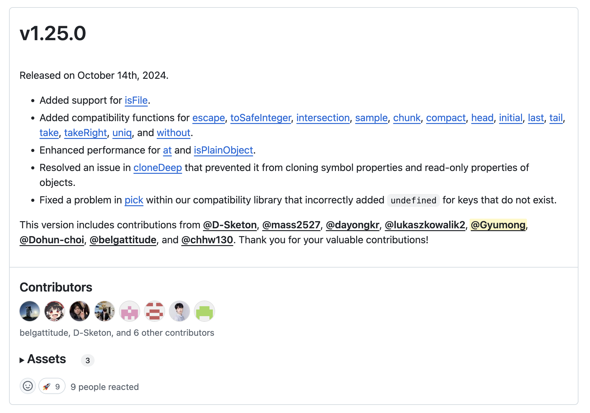

> "내가 더 멀리 보았다면 이는 거인들의 어깨 위에 서 있었기 때문이다." - 아이작 뉴턴 
> 얼마 전 오픈 소스에 기여하고 느낀점을 기록합니다.

 
 

# 오픈 소스에 기여하는 이유
지난 주말, 약속까지 남은 5시간 동안 카페에 앉아 노트북으로 어떤 활동을 할까 고민했다. 그때 평소 관심 있게 보던 오픈 소스 프로젝트, Toss의 [es-toolkit](https://es-toolkit.slash.page/) 이슈 목록이 떠올랐다.

현업에서 프론트엔드 개발자로 일할 때는 사용하던 라이브러리가 무언가 안될 때 이슈를 추적하고 내 서비스 코드단에서 해결하거나 이슈를 남기는 정도였지, 직접 기여를 하지는 않았다.
하지만 학생 신분으로 돌아온 지금, 기술적으로 성장하고자 오픈 소스 활동에 도전하기로 결심했다.

내가 생각하는 오픈 소스 기여의 장점은 여러 가지가 있다. 먼저, 오픈 소스는 말 그대로 공개된 코드이기 때문에, 사용 중인 라이브러리나 프레임워크의 동작 원리를 소스 코드로 직접 파악할 수 있다. 특히, '이 코드는 왜 이렇게 짰을까?' 고민하고 이해하며 성장한 부분도 크지만, 모노레포 구성, 프로젝트 구조, CI 설정 등을 통해 구조적인 학습을 할 수 있었다.

둘째로 나의 환경을 넘어서 성장할 수 있다. 아직 학생이거나 현업에서 일을 하지만 일상적인 개발을 하고 있는 사람, 혹은 코드를 좀 더 잘 작성할 수는 없을까? 고민하는 사람들에게 오픈 소스는 좋은 기회가 될 수 있다. 본인이 사용하거나 관심 있어하는 라이브러리를 찾아 기여하면서, 그 오픈 소스가 탄생하게된 철학을 바탕으로 코드를 작성하고, 코드 리뷰를 받으며 평소 본인 혹은 본인이 속한 집단 이외의  다양한 시각과 개발 스타일을 습득할 수 있다. 또한, 이슈와 PR에서 메인테이너 및 커뮤니티의 소통 방식을 보며 협업 능력도 키울 수 있다.

셋째, 도파민이 분비된다. 관심 있던 오픈 소스에 PR이 머지될 때, 작은 기여가 이루어졌다는 생각에 뿌듯함을 느꼈고, 평소 동경하던 개발자들과의 소통도 큰 즐거움이었다.
 
 

# 어떻게 기여를 시작하면 좋을까?
나 역시 오픈 소스 기여를 시작한 지 얼마 되지 않았지만, 나름대로 배운 방법을 공유해 보려 한다. 우선, 내가 평소에 사용하거나 관심이 있는 오픈 소스 프로젝트의 이슈와 PR을 살펴보며 시작했다. 이렇게 하면 프로젝트의 방향성이나 철학을 이해하고, 개발자들이 어떤 방식으로 소통하는지 파악할 수 있다. 또한 Contribute Guide나 Readme를 읽어 기여 방법과 절차를 익히는 것도 중요하다.

그다음, 프로젝트를 로컬 환경에서 실행하며 코드 구조를 파악한다. 이렇게 프로젝트에 익숙해진 후에는 기존 이슈를 해결하거나, 평소 추가되었으면 좋겠다고 생각했던 기능에 대해 요청하거나 발견한 버그에 대한 새로운 이슈를 등록하며 기여할 수 있다.

처음에는 적합한 이슈를 찾기가 어려울 수 있다. 그럴 때는 간단한 오타 수정이나 문서 번역처럼 작은 기여부터 시작해보자. 이런 기여를 통해 프로젝트의 흐름을 이해하게 되고, 커뮤니티와 소통하는 방법도 자연스럽게 익힐 수 있다. 또한, PR이 머지되었을 때의 성취감은 다음 기여를 할 때 큰 동기부여가 될 것이다.
 
 
# 기여하며 느낀 점

<figure style={{
    display: 'flex',
    flexDirection: 'column',
    justifyContent: 'center',
    alignItems: 'center',
    marginTop: '20px',
}}>
    

        
    

    <figcaption style={{
        textAlign: 'center',
        fontSize: '14px',
        color: '#888',
        marginTop: '10px',
    }}>
        es-toolkit에 sample 함수 추가하기
    </figcaption>
</figure>

- [fix typo in Korean translation](https://github.com/mdn/yari/pull/11244)
- [Add sample to compat layer](https://github.com/toss/es-toolkit/pull/708)

지난 6월, 처음 MDN에 기여를 하였다. 계기는 알고리즘을 풀다가 JS 문법을 살펴볼겸 문서를 뒤져보다 우연이었다. 그때는 아주 간단한 오타 수정이었다.
그치만 오픈 소스 기여가 처음이었기에 어떻게 이슈를 등록해야하는지, PR을 어떻게 작성해야하는지 등 조금 헤매었다. 그래도 PR이 머지되었을 때의 쾌감은 잊을 수 없었다.
그리고 최근 Toss의 es-toolkit에서 함수 하나를 추가하였다. 이 과정에서 다른 함수들은 어떻게 작성되어있는지, 테스트는 어떻게 하고 있는지, repo는 어떻게 구성되어 있고 관리는 어떤식으로 하는지, 해당 오픈 소스의 철학은 무엇인지, 또 이슈는 어떤식으로 달고 PR은 어떤식으로 작성하는지 등 많은 것을 배울 수 있었다.

오픈 소스에 기여하면서 ‘가장 이기적인 것이 가장 이타적일 수 있다’는 생각이 들었다. 개인적으로 얻는 배움과 성장의 기회가 크지만, 동시에 생태계와 다른 사람들에게도 긍정적인 영향을 미친다. 이러한 경험은 나를 더 성장시키고, 새로운 배움에 대한 열정을 계속 불러일으킨다. 아직 오픈 소스 기여를 시작하지 않은 사람이라면, 작은 기여부터 시도해보길 권한다. 비록 처음에는 낯설고 어려울 수 있지만, 그 과정에서 얻게 될 성취감과 배움은 그 이상의 가치를 가져다줄 것이다.

