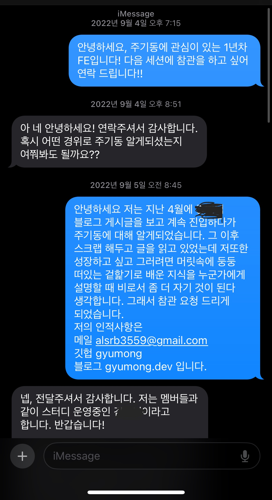
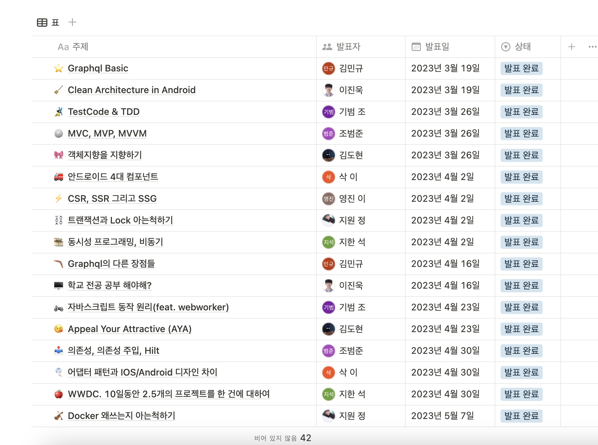
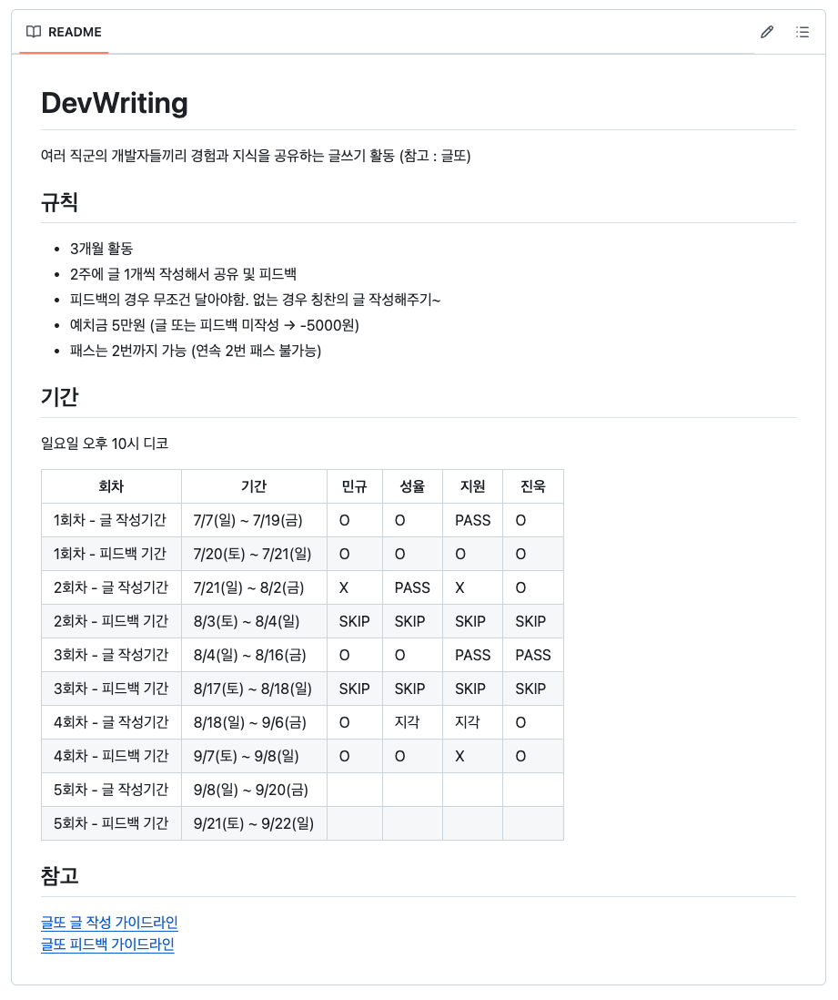

# 글쓰기에 대한 첫 도전

주니어 1년차 업무적으로는 조금은 적응이 되던 차 기술적으로 더 성장하고 싶던 시기였다. 기술에 관련된 글을 적고 싶었는데 용기가 없었다. 오히려 아무것도 모를 때 적었던 글이 더 쉬웠다. 조금 지난 이후엔 글의 주제를 고르기도, 그 주제에 대해 글로 풀어낼 만큼 이해를 하기도 어려웠다.
글을 쓰면서 무지함이 드러날까 봐 두려웠고, 그 두려움이 글쓰기를 주저하게 만들었다

어느 주말 나는 카페에서 웹서핑을 하고 있었다. 그때 우연히 어떤 포스팅을 읽게 되었다. 구체적인 사례나 글의 흐름, 일목요연하게 정리된 글을 보고 글을 쓰신 분의 다른 포스팅도 전부 읽어 보았다. 그러다 그분이 참여하는 기술 발표 스터디를 알게 되었다. 그 스터디는 it 연합동아리에서 뜻이 있는 사람들이 모여 진행하는 프라이빗한 소규모 스터디였다. 부끄러움보다 곁에서 배우며 성장하고 싶은 마음이 더 컸기에 용기를 내어 문자를 보내게 되었다.

 

    

        
    

 

외부에서 유입된 경우는 내가 처음이었다. 그래서인지 스터디에 참여하게 되었을 때 두려움이 있었다. 다들 3년차 이상의 다양한 분야의 개발자 혹은 창업자였다. 다른 분들의 발표를 들을 때마다 깊이감이 느껴졌다. 아 이게 짬인가? 라는 생각이 들었고 나도 좀 더 어려운 주제를 고르고자 했다.

- [Data Fetching, HTML Streaming and RSC: the Next Way or the Remix Way-1](https://www.notion.so/Data-Fetching-HTML-Streaming-and-RSC-the-Next-Way-or-the-Remix-Way-1-88e067c06e2941dab33ffa48d77ad1d1/)
- [유지보수에 용이한 코드와 구조](https://www.notion.so/0eee72db33914ea0b49ece0d3ed8454d)

내 기준 평소에 고민하던 것 이거나 흥미롭게 바라보던 것들이었다. 회사에서 배우거나 사용하는 기술과 관련이 있는 주제들이다. 예상 청중은 프론트 포함 기타 다른 분야 3년차 이상의 개발자들(내가 가고 싶던 회사에 근무하시는 분도 계셨다) 이었기에 이제 막 1년차가 된 나는 어떻게 발표를 준비해야 할지 고민이 많았다. 한 달에 1번 발표하는 일정은 버거웠다. 내가 정확히 모르는 것을 누군가에게 설명하기까지 이해에 많은 시간이 필요했기 때문이다. 작은 스터디 발표이지만 나에게는 중요한 일이었다. 그래서 동아리 친구들에게 발표 시연 후 피드백을 받아 보기도 했다.
이렇게 어색하지만 처음으로 예상 독자가 정해져 있는 글을 쓰게 되었다.

 

# 문화 만들어가기
 

<figure style={{
    display: 'flex',
    flexDirection: 'column',
    justifyContent: 'center',
    alignItems: 'center',
    marginTop: '20px',
}}>
    

        
    

    <figcaption style={{
        textAlign: 'center',
        fontSize: '14px',
        color: '#888',
        marginTop: '10px',
    }}>
        동아리 친구들을 모아 스터디를 시작했다.
    </figcaption>
</figure>
 

이전 스터디 경험은 매우 유익했다. 프론트엔드 외에 나에게 생소했던 블록체인과 같은 다양한 주제를 접할 수 있었고, 덕분에 배경지식이 확장되었다. 또한, 내가 공부하는 분야 외의 사람들에게 내 지식을 설명하기 위해 스스로 더 깊이 있게 이해할 필요가 있었기 때문에 그 과정에서 많이 성장했다. 이 스터디는 나에게 큰 자극이 되었고, 배움을 공유하는 방식이 인상 깊었다.

하지만 매주 주말 1~2시간 동안 진행되면서, 예상 독자가 3년 차 이상의 직장인들이라는 점에서 조금씩 부담을 느꼈다. 그분들의 시간을 가치 있게 하기 위해 더 깊이 있는 주제를 선정하려고 노력했지만, 그러다 보니 내가 평소 개발하면서 겪는 고민들과 점차 거리가 생기기 시작했다. 나는 더 가볍고 자유로운 주제로 글을 쓰고, 함께 고민할 수 있는 환경이 필요했다. 그래서 스터디가 끝난 후 그 경험을 바탕으로 교내 동아리 친구들과 새로운 스터디를 만들었다. 이전의 장점을 살리면서도, 나와 친구들이 더 편안하게 소통하고 성장할 수 있는 분위기를 만들고자 했다.

 

<figure style={{
    display: 'flex',
    flexDirection: 'column',
    justifyContent: 'center',
    alignItems: 'center',
    marginTop: '20px',
}}>
    

        
    

    <figcaption style={{
        textAlign: 'center',
        fontSize: '14px',
        color: '#888',
        marginTop: '10px',
    }}>
        약간의 쉼이 있었지만 시즌제로 다양하게 방식을 수정하며 글또를 시작하기 전 주까지 진행했다.
    </figcaption>
</figure>
 

- [프론트엔드에서의 테스트](https://github.com/CodingCatCrew/DevWriting/blob/main/%EB%AF%BC%EA%B7%9C/%ED%94%84%EB%A1%A0%ED%8A%B8%EC%97%94%EB%93%9C%EC%97%90%EC%84%9C%20%ED%85%8C%EC%8A%A4%ED%8A%B8.md)

서로 다른 분야에서 일하고 있는 친구들이 모여 다양한 주제를 공유하고, 서로의 글을 읽고 피드백을 주고받으며 성장할 수 있었다. 또한, 스터디를 통해 나는 글을 쓰는 것이 얼마나 중요한지 깨달았다. 글을 쓰는 것은 내 생각을 정리하고, 다른 사람들과 소통하며, 지식을 공유하는 좋은 방법이었다. 그 경험을 바탕으로, 나는 글또에 참여하게 되었다. 단순히 글을 쓰는 기술뿐만 아니라, 함께 배우고 성장하는 과정이 나에게 큰 동기부여가 되기 때문이다.
 
# 마무리 다짐

다시금 말하지만 기술적인 글쓰기는 여전히 나에게 어려운 일이다. 현재의 내가 추구하는 기술적인 글은 TIL이 아닌 비지니스 상황에서 최선의 선택을 다루는 글을 쓰고 싶다. 내가 단순히 배운 지식을 전달하는 것이 아니라, 내가 직접 경험하고 느낀 점을 녹여낸 글을 추구한다.

우리는 종종 ‘거인의 어깨 위에 서 있다’고 말한다. 나보다 뛰어난 개발자도 많고, 다양한 기술적 지식도 존재한다. 하지만 내가 직면한 문제와 동일한 상황에서 같은 고민을 하는 사람은, 아마도 지금 나 혹은 내 동료 외에는 없을 것이다. 그래서 내가 경험한 현실적인 문제와 그에 대한 최선의 해법을 기록하고, 그 과정을 공유하는 것이 나의 목표다.

글또에서 글쓰기에만 집중하는 것처럼 보일 수 있지만, 사실 나의 또 다른 목표는 네트워킹이다. 다양한 사람들과의 소통을 통해 사고를 확장하고, 서로의 경험을 나누면서 새로운 관점을 얻고 싶다. 최근에는 책읽어또, 다진마늘 같은 글또 내 소모임에도 참여하고 있다. 오랜만에 퇴사 후 슬랙이 다시 활성화되니 도파민이 돈다는 느낌도 든다. 😂

6개월 뒤 나는 어떤 글을 쓰고 있을까? 지금의 나와는 또 다른 관점에서, 더 넓어진 사고로 새로운 이야기를 풀어내고 있길 기대해본다.
